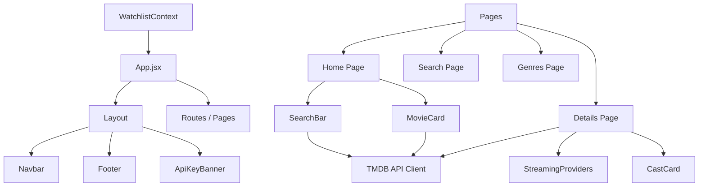

# 🍿 NextWatch – Modern Movie Discovery Platform

[](https://react.dev)
[](https://vite.dev)
[](https://tailwindcss.com)
[](https://www.themoviedb.org/)
[](https://opensource.org/licenses/MIT)

NextWatch is a client-side, movie and TV show discovery platform. Leveraging the TMDB API, it allows users to search, filter, explore trending media, view streaming availability, and manage their personal watchlists dynamically.

Designed with a high-fidelity glassmorphism user interface and smooth, GPU-accelerated micro-animations, it serves as a showcase for modern React 19 architecture, CSS transitions, and client-side state optimization.

---

## 🌐 Live Demo

**Live App:** [https://next-watch-web.vercel.app/](https://next-watch-web.vercel.app/)

---

## 📸 Interactive System Tour


---

## 🏗️ Architecture Overview

NextWatch uses a clean, unidirectional data flow design. Below is a high-level visual representation of how components, context providers, routes, and services interact:



---

## ✨ Core Features

- **🎬 Trending & Popular Feeds:** Instant access to trending daily media and popular movies sourced directly from TMDB.
- **🔍 Advanced Real-Time Search:** Multi-match search capabilities with debounce optimization to minimize API calls and prevent layout thrashing.
- **🔖 Context-Driven Library Management:** Track movies inside your "Watchlist" or "Watched" states. State is managed globally via React Context API and persisted locally via `localStorage`.
- **📡 Stream Provider Mapping:** Displays where titles are available for rent, buy, or stream depending on geographic location.
- **📱 Fully Responsive:** Adaptive layouts optimized for mobile, tablet, and desktop viewports, using Tailwind CSS v4.
- **⚡ Performance-First Compilation:** Compiles to modular, highly-cached standard static bundles.

---

## 🛠️ Tech Stack & Dependencies

- **Framework:** React 19 (Hooks, Context, StrictMode)
- **Build System:** Vite 7 (optimized build pipelines, path alias resolvers)
- **Styling Engine:** Tailwind CSS v4 (incorporating `@tailwindcss/vite` compiler plugin)
- **State Management:** React Context API + Local Storage persistence
- **Animation:** Framer Motion (page transitions, hover states, list entries)
- **Icons:** Lucide React
- **Client Utilities:** `clsx` & `tailwind-merge` for robust conditional class naming

---

## 📂 Project Structure

```text
src/
├── components/
│   ├── layout/          # Global layout structure, navbar, scroll restoration
│   ├── movie-card/      # Shared components
│   ├── movie-grid/      # Shared components
│   ├── search-bar/      # Shared components
│   └── ui/              # Atom-level reusable UI components
├── contexts/
│   └── watchlist-context.jsx
├── hooks/
│   └── use-debounce.js
├── pages/
│   ├── details/         # Details Page Feature (colocated cast-card, streaming-providers)
│   ├── genres/          # Genres Page Feature (colocated genre-card)
│   ├── home/            # Home Dashboard Page Feature
│   ├── not-found/       # 404 Routing Page
│   ├── recommendations/ # Recommendations filtering controller
│   ├── search/          # Search interface
│   ├── trending/        # Trending media dashboard
│   ├── watched/         # Watched history library view
│   └── watchlist/       # Watchlist library view
├── services/
│   └── tmdb.js
├── styles/
│   └── index.css
└── utils/
    └── cn.js
```

---

## 🚀 Getting Started

### 1. Prerequisites
- **Node.js** 20 or higher
- **NPM** or **PNPM** package manager
- **TMDB Read Access Token** (Obtainable free at [The Movie Database](https://developer.themoviedb.org/docs))

### 2. Installation

Clone the repository and install all dependencies:

```bash
git clone https://github.com/Ujjwallp/NextWatch_web.git
cd NextWatch_web
npm install
```

### 3. Environment Variables Configuration

Create a `.env.local` file in the root of the project and define your TMDB Token:

```env
# TMDB API Read Access Token (Bearer Token)
VITE_TMDB_TOKEN="your_tmdb_read_access_token_here"
```

*Note: The project is pre-configured to search for `VITE_TMDB_TOKEN` during API requests.*

### 4. Running Locally

Start the Vite development server:

```bash
npm run dev
```

Navigate to `http://localhost:5173` in your browser.

---

## 📦 Building for Production

To compile the application into lightweight, split chunks optimized for CDN delivery:

```bash
npm run build
```

This compiles static assets inside the `dist/` directory.

To preview the build locally:

```bash
npm run preview
```

---

## 🌐 Deployment Guidelines

### Vercel / Netlify
1. Connect your GitHub repository to the platform.
2. In the Build & Deploy settings:
   - **Build Command:** `npm run build`
   - **Publish Directory:** `dist`
3. Add `VITE_TMDB_TOKEN` in the platform's Environment Variables settings panel.
4. Deploy the site.

---

## 👨‍💻 Maintainers & Creators

- **Ujjwal Prakash** — Creator & Core Developer ([GitHub Profile](https://github.com/Ujjwallp))
