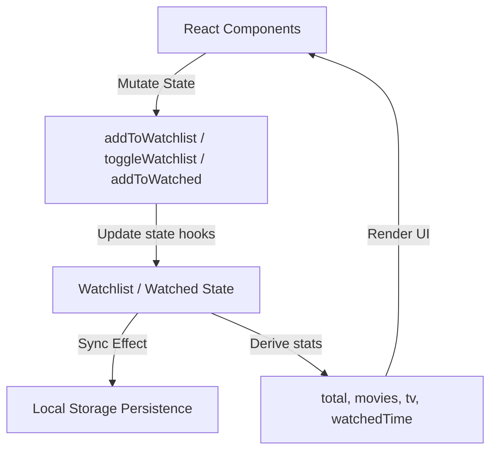

# 🏗️ NextWatch System Architecture Document

NextWatch is designed as a client-side React 19 web application compiling to static assets. It interfaces directly with third-party TMDB JSON REST endpoints. This document describes the application design, folder conventions, state interfaces, and optimization choices.

---

## 1. Directory Structure & Modular Design

The repository isolates logic to distinct folders based on purpose. This ensures components remain decoupled and easy to test:

```text
src/
├── components/
│   ├── layout/      # Global Layout wrapper, Navigation, Footer, global API key state banners.
│   ├── movies/      # Domain-specific components directly related to movies, casting, genre views, search logic.
│   └── ui/          # Generic, atomic design system components (buttons, badges, empty states, skeleton wrappers).
├── contexts/        # Global context provider for state tracking and persisted analytics.
├── hooks/           # Shared stateful custom React hook utilities (e.g. debouncers).
├── pages/           # High-level entry components mapping directly to application routes.
├── services/        # Service clients encapsulating authentication, data fetching, mapping logic, and endpoint lists.
├── styles/          # Design engine variables and Tailwind configurations.
└── utils/           # Helper functions for stylesheet conditional evaluation.
```

---

## 2. Routing Framework

Routing is handled client-side using `react-router-dom` v7. The app defines a client-side history router mapping paths to page-level controllers wrapped in a global layout shell:

* `/` ➔ `home.jsx`: Dashboards displaying trending feeds and popular genre selectors.
* `/genres` ➔ `genres.jsx`: Consolidated, style-decorated list of catalog genres.
* `/recommendations/:genreId` ➔ `recommendations.jsx`: Filters catalog listings specifically matching the selected genre.
* `/details/:mediaType/:id` ➔ `details.jsx`: Displays comprehensive metadata, trailers, cast records, and streaming platforms.
* `/search` ➔ `search.jsx`: Live debounced search console supporting media-type filters.
* `/watchlist` ➔ `watchlist.jsx`: User library displaying bookmarks and watchlist statistics.
* `/watched` ➔ `watched.jsx`: User history library mapping and reviewing completed titles.

---

## 3. Context State Engine (Global Library Management)

State management is handled using standard React Context. The `WatchlistProvider` manages global states for the user library:



### Persistence Design
* State transitions are persisted to local storage under keys `nextwatch_watchlist` and `nextwatch_watched`.
* Subscriptions use standard `useEffect` hooks triggered on watchlist modifications to ensure local sync is atomic.
* Statistics such as `total`, `movies`, `tv`, and `watchedTime` are computed inline to ensure instantaneous rendering without layout recalculation.

---

## 4. API Client Service Wrapper (`tmdb.js`)

All interactions with The Movie Database REST API are centralized within `src/services/tmdb.js`.

### Client Characteristics:
* **Authorization Headers**: Requests dynamically inject the environment variable `VITE_TMDB_TOKEN` as a `Bearer` authorization token.
* **Error Handling**: The fetch wrapper evaluates Response HTTP status codes. Non-2xx responses are mapped to descriptive JS Errors, which bubbles up to page error boundaries.
* **Dynamic Sizing**: Poster and backdrop URLs are computed dynamically based on resolution sizes (e.g. `w342`, `w500`, `w1280`) configured in standard configuration constants.

---

## 5. Performance Optimizations

NextWatch leverages several performance mechanisms to maintain high frame rates and quick load times:

1. **Query Debouncing (`use-debounce`)**: Search inputs employ custom debouncing timers (400ms) to delay updates until user typing pauses. This reduces network overhead and prevents thread blocking.
2. **Standard Chunk Splitting**: By removing StackBlitz/sandbox inline build plugins, Vite compiles scripts into split, cached chunks (`dist/assets/*.js`). Standard vendor libraries (e.g. Framer Motion, Lucide) are separated from client controllers, reducing cache invalidation scopes.
3. **Lazy Image Loading**: Images utilize native browser lazy-loading (`loading="lazy"`) and are monitored using load handlers to switch from skeletal mock loaders to high-resolution posters gracefully.
