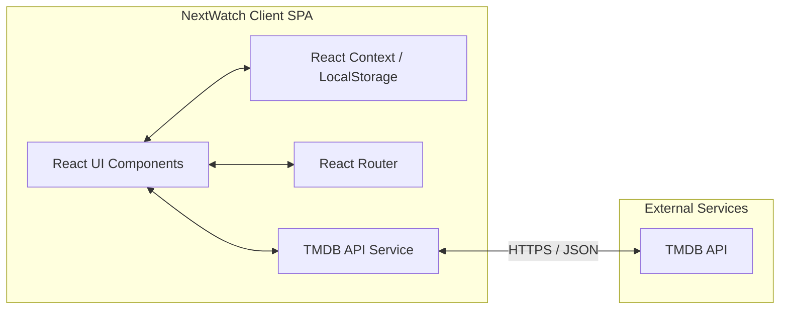
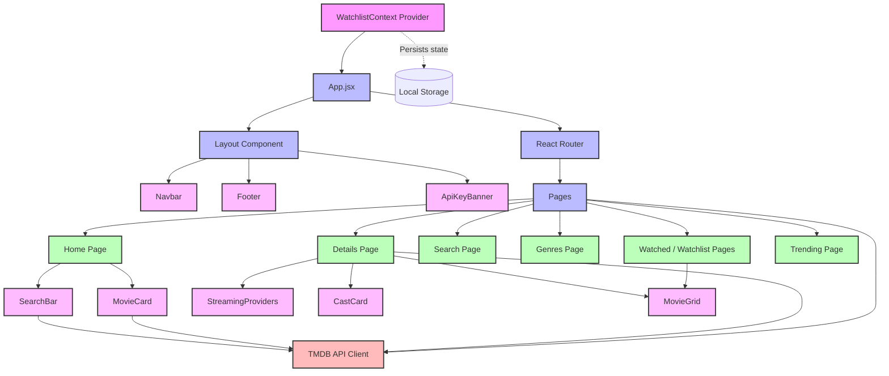

# NextWatch Architecture Overview

This document provides a detailed architectural breakdown of the **NextWatch** platform, illustrating how the client-side application is structured, how data flows through the application, and the technologies powering it.

## High-Level System Architecture

NextWatch operates as a pure client-side Single Page Application (SPA) that interfaces directly with a third-party REST API.

## Component Architecture Data Flow

The application follows a clean, unidirectional data flow design.

## Directory Structure & Modules

The codebase is organized modularly by feature and function:

- **`src/components/`**: Houses all reusable UI elements. Divided into layout components (Navbar, Footer), domain components (MovieCard, SearchBar), and generic atomic UI elements.
- **`src/pages/`**: Contains top-level route components. Each page represents a distinct view (Home, Details, Search) and often colocates page-specific components.
- **`src/contexts/`**: Contains global state providers, such as the `WatchlistContext` which manages the user's saved movies.
- **`src/hooks/`**: Custom React hooks, e.g., `use-debounce.js` used to optimize search API calls.
- **`src/services/`**: API abstraction layer. The `tmdb.js` file handles all direct HTTP communication with the external TMDB API.
- **`src/styles/`**: Global stylesheets, primarily configuring Tailwind CSS.

## Tech Stack Overview

| Layer | Technology | Purpose |
| :--- | :--- | :--- |
| **Framework** | React 19 | Component-based UI rendering, Hooks, Context |
| **Routing** | React Router v7 | Client-side navigation and URL synchronization |
| **Build Tool** | Vite 7 | HMR, dev server, and optimized production bundling |
| **Styling** | Tailwind CSS v4 | Utility-first styling and responsive design |
| **Animation** | Framer Motion | Smooth layout transitions, micro-interactions |
| **State** | React Context + LocalStorage | Global state management without heavy libraries (Redux) |
| **Icons** | Lucide React | Clean, consistent SVG icon set |
